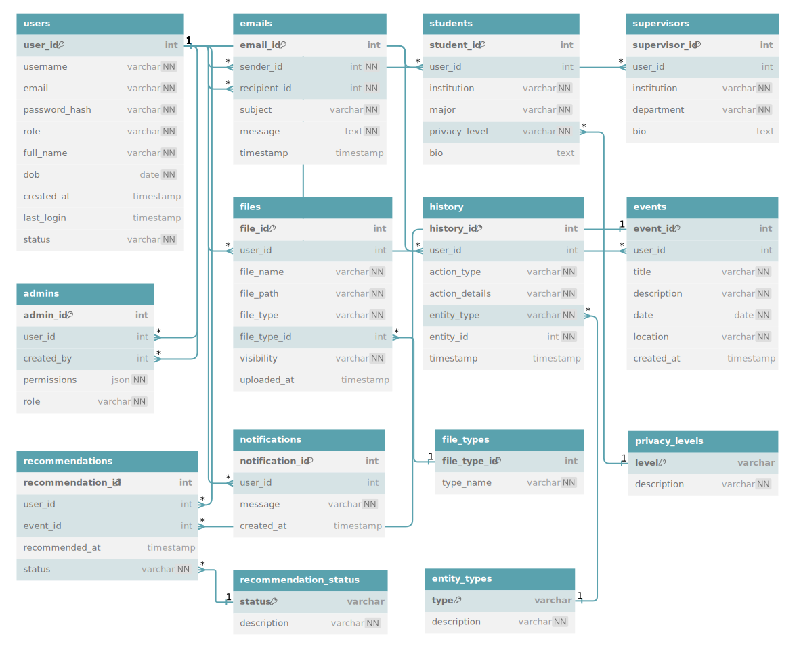
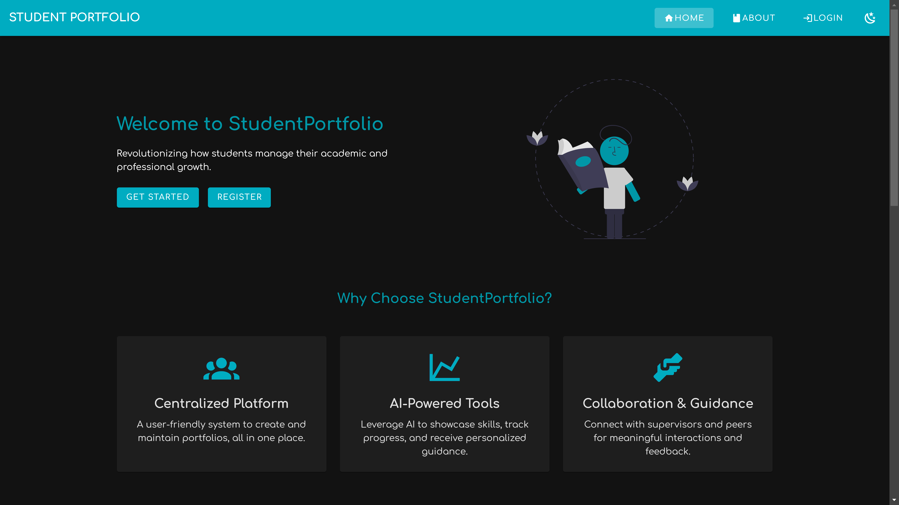
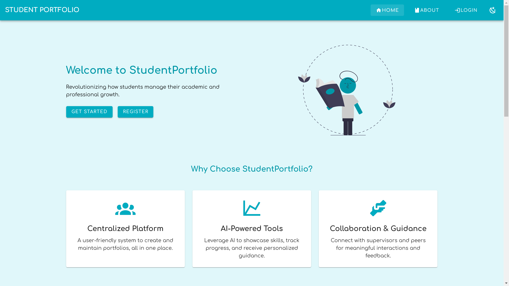
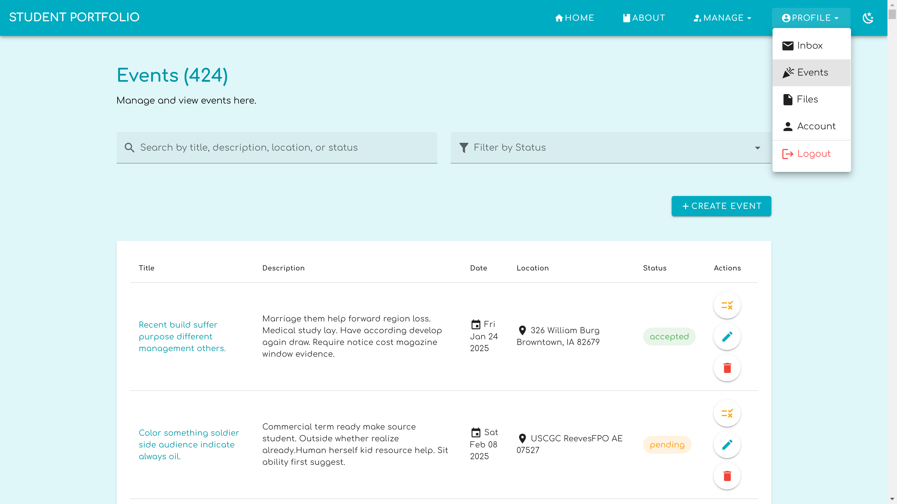
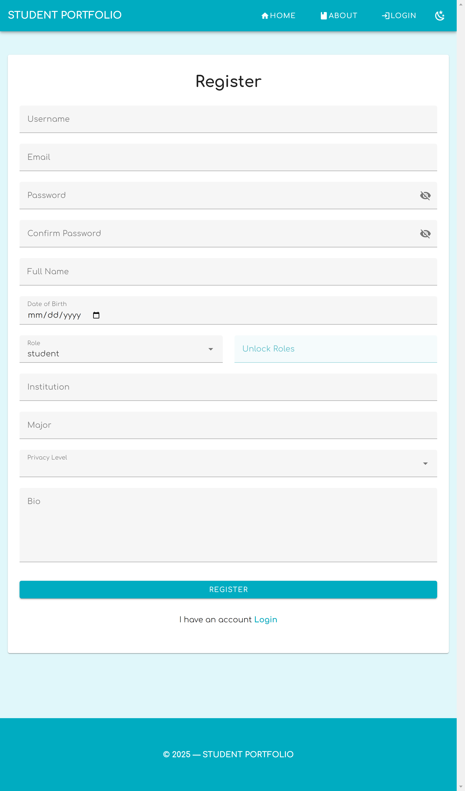
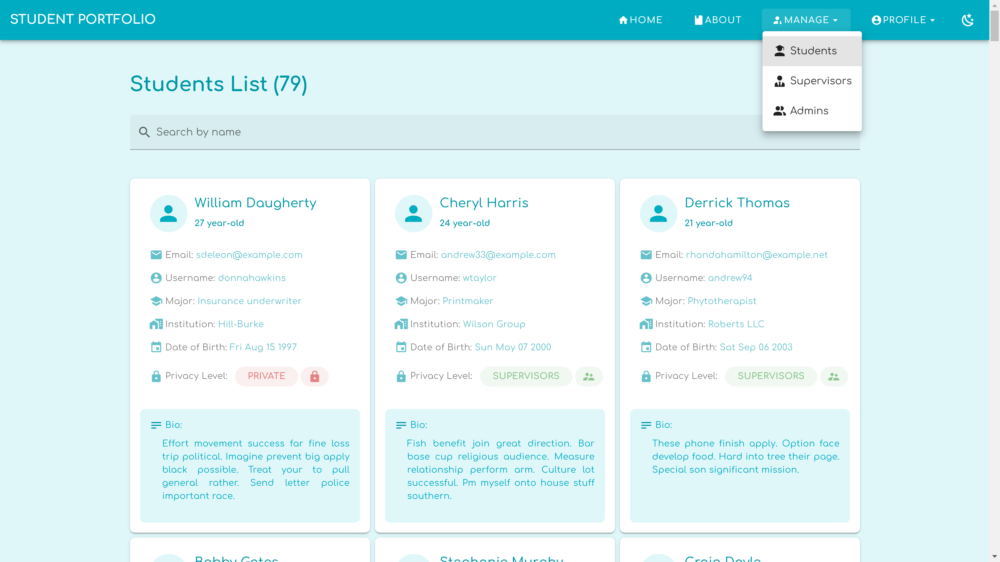
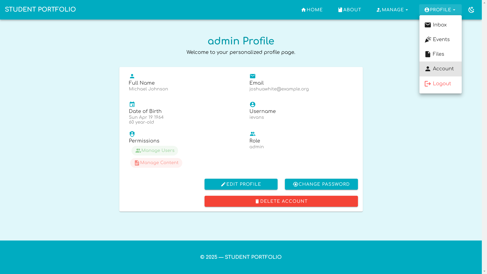

# StudentPortfolio: Comprehensive Project Description

## Main Purpose

StudentPortfolio is an advanced platform that revolutionizes how students manage their academic and professional growth. It provides a centralized, user-friendly system to create and maintain portfolios while promoting collaboration and guided learning. The project leverages AI tools, intuitive design, and robust backend systems to cater to the needs of students, supervisors, and administrators in educational and professional settings.

The platform aims to streamline the process of showcasing skills, managing academic activities, and enabling meaningful interactions between stakeholders, ensuring a well-rounded and future-ready student experience.

---

## Key Goals

### Empower Students

- Offer tools to document their academic, personal, and professional journeys through portfolios.
- Provide AI-driven learning support to overcome academic challenges, gain new skills, and grow.

### Facilitate Collaboration

- Enable supervisors to guide students effectively by providing structured feedback and tailored recommendations.
- Promote teamwork through group projects and events.

### Simplify Administration

- Help administrators manage users, permissions, platform security, and overall operational efficiency.

### Enhance Security and Accessibility

- Ensure secure handling of sensitive user data while offering role-based access controls and privacy settings.

---

## Core Functionality

### Role-Based Features

**Students:**

- Build comprehensive, customizable portfolios.
- Track academic achievements and personal growth.
- Leverage AI to receive learning suggestions and problem-solving support.

**Supervisors:**

- Review student portfolios and provide actionable feedback.
- Recommend events, projects, or learning resources to students.

**Administrators:**

- Manage the platform, ensuring a secure and optimized environment.
- Track platform activity using audit logs.

---

### File Management

- Securely upload and categorize files.
- Manage visibility for file sharing based on privacy preferences.

### Event Management

- Create, promote, and discover academic and extracurricular events.
- Enable users to connect with opportunities tailored to their portfolios and activities.

### AI-Powered Learning Assistance

- Leverages the **Hugging Face Transformers** library for natural language processing.
- Integrates a **fine-tuned question-answering pipeline** using the `distilbert-base-cased-distilled-squad` model to provide accurate and concise answers to academic questions.
  ```python
  from transformers import pipeline
  qa_pipeline = pipeline("question-answering", model="distilbert-base-cased-distilled-squad")
  ```

#### Example:

```json
{
  "question": "Velocity from Earth",
  "response": "Sure! Here's what I found: 11.2 km/s.\n\nHere's the full information:\nThe escape velocity from Earth is approximately 11.2 km/s.\n\nHere are some recommended topics based on your question:\n1. Hubble's law states that the velocity of a galaxy is proportional to its distance from us.\n2. The moon is moving away from Earth at a rate of about 3.8 cm per year.\n3. Momentum is the product of mass and velocity, p = mv.\n4. Angular velocity is measured in radians per second."
}
```

```
Sure! Here's what I found: 11.2 km/s.

Here's the full information:
The escape velocity from Earth is approximately 11.2 km/s.

Here are some recommended topics based on your question:
  1. Hubble's law states that the velocity of a galaxy is proportional to its distance from us.
  2. The moon is moving away from Earth at a rate of about 3.8 cm per year.
  3. Momentum is the product of mass and velocity, p = mv.
  4. Angular velocity is measured in radians per second.
```

### Collaboration Tools

- Group management for project teamwork.
- Integrated messaging systems for communication between users.

### Security and Tracking

- Audit logs to monitor actions like logins and updates.
- Activity tracking to help users understand and optimize their engagement.

---

## How It Works

### Frontend

- **Built With:** Vue.js and Vuetify
- **Functionality:** Provides a modern, responsive, and user-friendly interface.
- **Components:**
  - Intuitive forms for profile updates, file uploads, and event creation.
  - AI integration for an interactive Q&A interface.
- **Benefits:**
  - Simplifies navigation and interaction for users of varying technical expertise.

### Backend

- **Built With:** Python Flask and SQLite
- **Functionality:** Handles data storage, retrieval, and API communication.
- **Components:**
  - RESTful API for seamless frontend-backend communication.
  - Secure user authentication using hashed passwords.
- **Benefits:**
  - Lightweight and scalable for efficient handling of multiple users.

### Database

- **Built With:** SQLite
- **Functionality:** Stores user data, portfolios, files, and event details.
- **Benefits:**
  - Robust yet simple to manage, ideal for initial deployment.

### AI Integration

- **Purpose:**
  - Provide immediate assistance to students with academic problems.
  - Generate personalized recommendations to enhance learning.
- **Benefits:**
  - Makes the platform more interactive and value-driven.

---

## Technologies Used

### Backend

- **Flask:** Lightweight web framework for building the backend.
- **SQLite:** Database for storing user data, portfolios, and events.
- **Flask-JWT-Extended:** For secure user authentication and authorization.
- **Flask-CORS:** To handle Cross-Origin Resource Sharing.
- **Flask-Migrate:** For handling database migrations.

### Frontend

- **Vue.js:** JavaScript framework for building the user interface.
- **Vuetify:** UI library for Vue.js to create a responsive and visually appealing design.
- **Vue Router:** For handling client-side routing.
- **Axios:** For making HTTP requests to the backend.
- **Vue Toastification:** For displaying toast notifications.

### Development Tools

- **Git:** Version control system for tracking changes and collaborating with team members.
- **Vite:** Build tool for optimizing and bundling frontend assets.
- **ESLint:** Linting tool for maintaining code quality and consistency.
- **Prettier:** Code formatter for ensuring a consistent code style.

---

## Who Will Benefit?

**Students:**

- Can track, showcase, and improve their academic journey.
- Gain better career opportunities through well-documented portfolios.

**Supervisors:**

- Access tools to effectively guide and mentor students.
- Share valuable recommendations tailored to individual student needs.

**Administrators:**

- Manage platform operations with ease.
- Ensure data security and compliance with privacy standards.

---

## Why Choose StudentPortfolio?

- **Modern Design:** Combines Vuetify's sleek frontend with Flask's efficient backend for an unmatched user experience.
- **AI Integration:** Provides an edge with features like Q&A assistance and personalized learning, setting it apart from basic portfolio tools.
- **Collaboration-Friendly:** Supports teamwork and communication, preparing students for real-world professional environments.
- **Scalability:** Designed for seamless integration of new features as user needs evolve.
- **Accessibility:** Offers an intuitive interface with role-based functionality to meet diverse requirements.

---

## Conclusion

StudentPortfolio is more than just a portfolio builder; it's a comprehensive ecosystem for student growth, mentorship, and streamlined administration. It empowers students to document their journey, enhances collaboration with supervisors, and simplifies management tasks for administrators. By integrating modern technology, security, and user-friendly design, StudentPortfolio sets a new benchmark in academic and professional portfolio management.

---

# Database System: Comprehensive Analysis and Workflow Documentation

This database is the core of a sophisticated student portfolio system. It supports multiple user roles, efficient data management, and streamlined workflows to promote academic interactions between students, supervisors, and administrators.

---

## Actors and Their Roles

### 1. User (Parent Entity)

The User entity forms the foundation of the system, centralizing common attributes and enabling role-specific extensions.

**Purpose:**  
Manages user identity, authentication, and role assignment.

**Attributes:**

- `user_id`: Unique identifier for each user.
- `username`, `email`: Ensure distinct identification.
- `role`: Defines the user type (student, supervisor, admin).
- `status`: Tracks the account state (active, inactive).
- `created_at`, `last_login`: Audit timestamps to track user activity.

**Relationships:**

- One-to-one linkage with specific role entities (Student, Supervisor, Admin).
- One-to-many links with actionable entities (File, Event, Notification).

---

### 2. Student (Specialized Profile)

Students represent the core audience of the platform, aiming to showcase achievements and interact with mentors.

**Attributes:**

- **Personal**: Full name, date of birth, biography (bio).
- **Academic**: Institution, major field of study.
- **Privacy**: Controlled via the PrivacyLevel entity.

**Privacy Management:**

- Data visibility is tiered (public, private, etc.), allowing students to customize accessibility.

**Workflow Role:**

- Upload files showcasing work (via File).
- Participate in events for academic exposure (via Event and Recommendation).

---

### 3. Supervisor (Specialized Profile)

Supervisors are academic professionals mentoring students and enabling opportunities.

**Attributes:**

- `institution`, `department`: Reflect institutional affiliations.
- `bio`: Highlights expertise for transparency and trust.

**Workflow Role:**

- Mentor students through one-on-one interactions.
- Provide event recommendations, enabling students to participate in curated opportunities.

---

### 4. Admin (Specialized Profile)

Admins are the custodians of system operations, ensuring smooth platform functionality.

**Attributes:**

- `created_by`: Tracks the creator of each admin account.
- `permissions`: JSON-structured roles for specific admin rights (e.g., manage_users, manage_content).

**Workflow Role:**

- Create and manage user accounts.
- Configure platform settings and audit user activities.

---

## Supporting Entities

### 1. PrivacyLevel

**Purpose:**  
Controls visibility of student data.

**Attributes:**

- `level`: Privacy setting identifier (public, private, etc.).
- `description`: Details the scope of each level.

---

### 2. File

**Purpose:**  
Facilitates file storage and sharing for user portfolios.

**Attributes:**

- **Metadata**: `file_name`, `file_path`, `file_type`.
- **Accessibility**: Controlled via visibility field (e.g., public or restricted).

**Workflow Role:**

- Files showcase students' work and are linked to specific events or activities.

---

### 3. Event

**Purpose:**  
Represents academic and professional opportunities.

**Attributes:**

- **Details**: `title`, `description`, `location`, and `date`.
- **Timestamps**: Capture creation and modification times.

**Workflow Role:**

- Central to the recommendation system, linking supervisors and students.

---

### 4. Recommendation

**Purpose:**  
Tracks supervisor endorsements for students’ participation in events.

**Attributes:**

- `status`: Current state of the recommendation (pending, approved, etc.), managed through the RecommendationStatus entity.

---

### 5. Notification

**Purpose:**  
Delivers alerts and updates to users.

**Attributes:**

- `message`: Notification content.
- `created_at`: Timestamp to track notification delivery.

---

### 6. History

**Purpose:**  
Provides a detailed log of user actions for audit and traceability.

**Attributes:**

- `action_type`: Type of activity (e.g., login, upload).
- `entity_type`, `entity_id`: Tracks the specific entity affected.
- `timestamp`: Logs the time of the action.

---

## Data Relationships

### Entity Map

| Parent Entity | Child Entities             | Relationship | Purpose                                                                     |
| ------------- | -------------------------- | ------------ | --------------------------------------------------------------------------- |
| User          | Student, Supervisor, Admin | One-to-One   | Establishes role-specific profiles for each user.                           |
| User          | File, Event, Notification  | One-to-Many  | Supports user actions like uploads, event participation, and notifications. |
| Student       | PrivacyLevel               | Many-to-One  | Customizes visibility for student data.                                     |
| Supervisor    | Recommendation             | One-to-Many  | Links supervisors to their recommendations for events.                      |
| Event         | Recommendation             | One-to-Many  | Tracks which students are recommended for specific events.                  |

---

## Workflow Documentation

### User Creation

- Admins register users through the system interface.
- A base User entry is created, followed by a corresponding role-specific profile (Student, Supervisor, or Admin).

### Student Interaction

- Students upload files to their portfolio.
- Visibility is managed via PrivacyLevel, ensuring adherence to preferences.
- Students participate in events based on supervisor recommendations.

### Supervisor Mentorship

- Supervisors oversee students within their department or institution.
- Recommendations are made for events, tracked with RecommendationStatus for transparency.

### Admin Oversight

- Admins create events, manage user accounts, and configure system rules.
- Notifications and logs in History provide visibility into all platform activities.

---

## Scalability and Integrity

### Normalization and Modularity

- The database design avoids redundancy through a normalized schema.
- Modular entities (e.g., File, PrivacyLevel) support extensibility without disrupting existing workflows.

### Role-Based Access Control

- Role segmentation restricts access to sensitive data, promoting security and integrity.

### Growth-Ready Architecture

- Additional roles (e.g., industry sponsors) and features (e.g., performance analytics) can be seamlessly integrated.

---

## Database Schema



---

## Conclusion of database

This database is a well-engineered solution that provides scalability, efficiency, and security. Its modular structure supports diverse workflows, empowering students, supervisors, and admins to collaborate effectively. Every aspect—from privacy controls to audit logs—is designed to meet professional standards and adapt to future needs.

---

## UI Design 

### Homepage (Dark View)


*The dark view of the homepage provides a sleek and modern interface for users who prefer a darker theme.*

### Homepage (Light View)


*The light view of the homepage offers a clean and bright interface for users who prefer a lighter theme.*

### Events View


*The events view allows users to browse and participate in various academic and extracurricular events.*
*The events view allows supervisors and administrators to browse, update, and manage various academic and extracurricular events, including their data and status.*


### Register


*The registration interface guides new users through the process of creating an account on the platform.*

### Students View


*The students view provides a comprehensive list of students, showcasing their profiles and achievements.*

### User Admin


*The user admin interface offers administrators tools to manage user accounts and platform settings.*

---